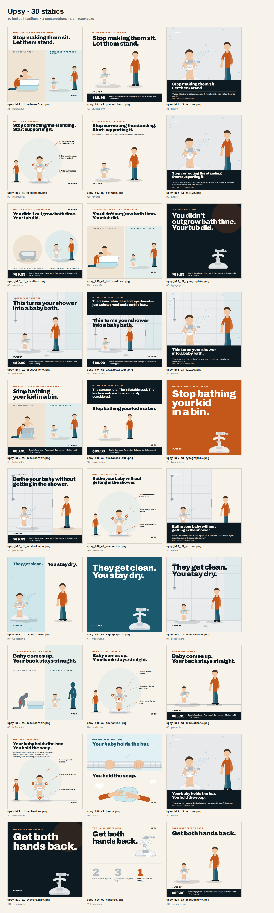

# Upsy — 30 static ads

Thirty 1:1 static ad creatives (1080×1080 PNG) built from **Upsy · Static Ad Creative
Brief** — 10 locked headlines × 3 constructions each, for US Meta / TikTok / Instagram.



## Build

```bash
npm install          # links playwright
npm run build        # renders all 30 into out/
node build/build.mjs h05     # render a subset by filename fragment
```

Output lands in `out/`, named per the brief:
`upsy_h[01-10]_c[1-3]_[construction].png`

## Swapping in the real product photo

Every ad uses a **vector stand-in** of the Upsy frame, redrawn from your product
photo: wide triangular non-slip mat with the embossed grip ring, two-stage telescoping
post with the height scale and lock lever, padded adjustable waist bar, and the grey
shower-head cradle on top with the handheld head seated in it. Your product page
(`cozybaby.shop/products/bath`) is blocked by this environment's network egress and the
photo was never written to disk, so this is drawn by eye, not traced.

To swap in the real thing:

1. Save a **transparent-background** cutout to `build/assets/product.png`
   (frame alone) and optionally `build/assets/product-child.png` (frame with a child
   in it).
2. `npm run build`

The renderer detects the files and drops them into the same 400×540 local box every
layout already positions — scale, floor line and shadows all carry over. Nothing else
changes. Note that `product-child.png` also replaces the illustrated child, so it must
show an adult present if a child is visible (see Compliance below).

## The offer

Two offers were supplied. Per your instruction, **every ad that shows price uses
Offer 2**:

| | |
|---|---|
| Offer 1 (not used on any static) | $69.99 + $7 shipping — product only |
| **Offer 2 — used throughout** | **$89.99 total** — Upsy frame + parent stool + baby sponge + $15 store credit + free shipping |

Eleven of the thirty carry the offer — ten as a bottom bar, one (#2 c2) as a single
line under the headline. The other nineteen run clean, so you can test offer vs.
no-offer against the same headline. Offer copy lives in one place —
`build/chrome.js` → `OFFER` — so a price change is a one-line edit and a rebuild.

**Headline #7's three concepts deliberately carry no offer, no sub-headline and no
feature list**, per the brief: "the brevity is the asset. Do not clutter it."

## The 30


### Headline #1 — SA2 won't sit

> **Stop making them sit. Let them stand.**

| File | Construction | What it does |
|---|---|---|
| `upsy_h01_c1_beforeafter.png` | beforeafter | Contrast construction. Parent is present and steadying on the left — never correcting or pushing the child down. |
| `upsy_h01_c2_producthero.png` | producthero · offer | The permission. Toddler upright and content, parent relaxed and washing — relief, not safety compliance. |
| `upsy_h01_c3_native.png` | native | In-the-moment framing. No invented review, name or rating. |

### Headline #2 — SA2 won't sit

> **Stop correcting the standing. Start supporting it.**

| File | Construction | What it does |
|---|---|---|
| `upsy_h02_c1_mechanism.png` | mechanism | Mechanism diagram. Labels name parts of the object only — no specs, no claims. |
| `upsy_h02_c2_reframe.png` | reframe · offer | The most explanatory of the ten. Plain language only — no clinical styling, no age or weight range printed. |
| `upsy_h02_c3_native.png` | native | Native framing of the reframe. |

### Headline #3 — SA2 won't sit

> **You didn’t outgrow bath time. Your tub did.**

| File | Construction | What it does |
|---|---|---|
| `upsy_h03_c1_usvsthem.png` | usvsthem · offer | Generic unbranded infant-tub silhouette. No competitor logos or packaging. |
| `upsy_h03_c2_beforeafter.png` | beforeafter | Old versus new, plainly. |
| `upsy_h03_c3_typographic.png` | typographic · offer | Type-led reading of the same two-clause contrast. |

### Headline #4 — SA1 shower-only

> **This turns your shower into a baby bath.**

| File | Construction | What it does |
|---|---|---|
| `upsy_h04_c1_producthero.png` | producthero · offer | Environment first. Unmistakable walk-in shower. NO bathtub anywhere in frame. |
| `upsy_h04_c2_avatarcallout.png` | avatarcallout · offer | Names the situation before naming the product. No bathtub in frame. |
| `upsy_h04_c3_native.png` | native | Candid in-the-stall framing. No bathtub anywhere. |

### Headline #5 — SA1 shower-only

> **Stop bathing your kid in a bin.**

| File | Construction | What it does |
|---|---|---|
| `upsy_h05_c1_beforeafter.png` | beforeafter · offer | The bin is the hero of the before. Punches at the situation, never at the parent. |
| `upsy_h05_c2_avatarcallout.png` | avatarcallout · offer | Recognition, not shame. Nothing that reads as judging a family for improvising. |
| `upsy_h05_c3_typographic.png` | typographic | High contrast, minimal, confident — art direction matched to the tone of the line. |

### Headline #6 — SA1 shower-only

> **Bathe your baby without getting in the shower.**

| File | Construction | What it does |
|---|---|---|
| `upsy_h06_c1_producthero.png` | producthero · offer | Spatial relationship is the message: child inside, parent outside — dressed, dry, upright, within arm’s reach. |
| `upsy_h06_c2_mechanism.png` | mechanism | The docked wand is the supporting proof for the dry-parent promise. |
| `upsy_h06_c3_native.png` | native | Parent stays visibly present and within reach — never framed as leaving the room. |

### Headline #7 — SA1 shower-only

> **They get clean. You stay dry.**

| File | Construction | What it does |
|---|---|---|
| `upsy_h07_c1_typographic.png` | typographic | Clean two-panel split: child and water on one side, dry parent on the other. |
| `upsy_h07_c2_typographic.png` | typographic | Shortest headline in the set carrying the boldest type. Deliberately uncluttered. |
| `upsy_h07_c3_producthero.png` | producthero | Simplest photographic-style read of the split. No feature list. |

### Headline #8 — SA3 back pain

> **Baby comes up. Your back stays straight.**

| File | Construction | What it does |
|---|---|---|
| `upsy_h08_c1_beforeafter.png` | beforeafter | Posture in silhouette. No anatomical labels, no clinical chart, no medical claim. |
| `upsy_h08_c2_mechanism.png` | mechanism | Shows the change in level. Describes the object; diagnoses nothing. |
| `upsy_h08_c3_producthero.png` | producthero · offer | Upright parent, raised child, one clean read. |

### Headline #9 — SA3 back pain

> **Your baby holds the bar. You hold the soap.**

| File | Construction | What it does |
|---|---|---|
| `upsy_h09_c1_mechanism.png` | mechanism | Best candidate in the set for a mechanism-diagram treatment. |
| `upsy_h09_c2_hands.png` | hands | Hands-led composition. Parent’s hands stay in frame and busy washing — never off the child and out of frame. |
| `upsy_h09_c3_native.png` | native | Candid framing of the role split. |

### Headline #10 — SA3 back pain

> **Get both hands back.**

| File | Construction | What it does |
|---|---|---|
| `upsy_h10_c1_typographic.png` | typographic | Four words, enormous type, extremely simple image. |
| `upsy_h10_c2_numeric.png` | numeric | Counting treatment — two hands, three jobs, the missing hand. |
| `upsy_h10_c3_producthero.png` | producthero · offer | Hands free TO WASH — the adult is present, close and attending in every frame. |

## Construction spread

Each headline gets three genuinely different **constructions**, not three colourways:

| Construction | Count | Headlines |
|---|---|---|
| Product hero | 6 | #1, #4, #6, #7, #8, #10 |
| Native / in-the-moment | 5 | #1, #2, #4, #6, #9 |
| Typographic | 5 | #3, #5, #7, #10 |
| Before / after | 4 | #1, #3, #5, #8 |
| Mechanism diagram | 4 | #2, #6, #8, #9 |
| Avatar call-out | 2 | #4, #5 |
| Reframe | 1 | #2 |
| Us vs them | 1 | #3 |
| Hands crop | 1 | #9 |
| Numeric | 1 | #10 |

No headline repeats a construction, so each trio tests three different ways of making
the same argument.

## Correction: the brief's "hero mechanism" was wrong

§1 of the brief describes a **"three-sided chest rail"** that "triggers the natural
palm-grip reflex", plus "multi-point friction grip" pads — and calls it *the hero
mechanism*. §4 of the same brief admits these came from category data, not Upsy's spec
sheet, and asks for them to be confirmed.

Your product photo and reviews confirm they are not what the product does:

| Brief assumed | Actually | Evidence |
|---|---|---|
| Three-sided chest rail gripped by the child | Padded **adjustable locking waist bar** the child is held at | "the locking waist clamps are adjustable… she tried to pull herself out of the clamps and couldn't, it fits snug enough but can be adjusted wider or tighter" |
| Child stabilises themselves by holding on | Frame holds the child; the bar is something to hold, not the mechanism | same review |
| Multi-point friction pads vs. suction | Wide mat that stays put | "doesn't move around in the shower… stability was surprisingly good"; "The base stays stable during use" |
| Shower wand dock *(unconfirmed)* | **Confirmed** — and it is the strongest proof in the set | "It keeps the handheld shower head in place so I can use both hands to wash my little one without constantly adjusting the sprayer" |

All four mechanism-diagram ads were relabelled to describe only what the photo and the
reviews evidence. Nothing in any image now claims a palm-grip reflex, a three-sided
rail, or friction pads.

**Headline #9 is unaffected** — "Your baby holds the bar. You hold the soap." is still
literally true and still locked; the bar is real, it is just a waist bar rather than a
grip rail. Worth knowing for the landing page, though, if it currently sells the
palm-grip story.

## Reviews

Five real customer reviews were supplied and are stored in `build/reviews.js` with the
exact excerpt used in each ad. Five of the six native concepts now carry one, verbatim
— trimmed only with ellipses, never reworded:

| Ad | Excerpt used |
|---|---|
| `upsy_h01_c3_native` | "My grand daughter loves bath time again. No more fussing to sit in the tub. She loves standing." |
| `upsy_h02_c3_native` | "My daughter who is 19 months hated regular bath tubs and fought me the entire time… She was comfortable after a few minutes." |
| `upsy_h04_c3_native` | "Very sturdy, easy to set up, doesn't move around in the shower… stability was surprisingly good." |
| `upsy_h06_c3_native` | "It keeps the handheld shower head in place so I can use both hands to wash my little one without constantly adjusting the sprayer." |
| `upsy_h09_c3_native` | "Very sturdy, easy to use, and makes bath time much easier. My baby feels secure." |

Attribution is the neutral **"Verified customer review"**. No reviewer names, star
ratings, platform badges or review counts appear anywhere, because none were supplied —
inventing them would be fabricated social proof regardless of the reviews being real.
If you have the source platform and star ratings, they can be added.

The fifth review ("Easy to assemble, make my life so much easier…") is stored but unused;
its "make sure your baby can stand" caveat is a product-page line, not ad copy.

## Compliance — how §5 of the brief was applied

- **Headline text is locked.** The build fails if any concept's rendered lines do not
  reconstruct its headline character-for-character. Headline #3 uses the typographic
  apostrophe (`didn’t`).
- **An adult is present in every image containing a child.** Audited across all 30.
  The four mechanism diagrams and the us-vs-them ad carry an attending parent beside
  the frame for this reason; two typographic ads show the frame with no child at all.
- **Never implies unsupervised use.** No ad shows an adult out of frame, turned away or
  in another room. #10's eyebrow reads "Both hands free to wash", not "hands-free".
- **No invented specifications.** No age range, weight limit, dimension, material claim,
  percentage, certification badge or standard number appears in any image — including
  the "roughly 7–24 months" band from the brief, which is unconfirmed.
- **No medical or authority styling.** #8 sells posture only. No white coats, seals,
  pediatric/AAP/CPSC cues, anatomical labels or clinical charts. The posture ads use
  plain silhouettes and a dashed spine trace, not a diagram.
- **No competitor branding.** #3's "before" is a generic unbranded infant-tub
  silhouette; #5's is a generic tote.
- **No fabricated social proof.** The native ads quote **real supplied reviews**,
  verbatim, under a neutral "Verified customer review" line. No invented names, star
  ratings, platform badges or review counts.
- **Water shown conservatively.** Shallow, child upright and holding the rail, adult
  active in frame.

## Copy that is not the headline

The brief says everything outside §3 is direction, not copy. Three constructions it
asks for cannot exist without a few words, so these were written from the direction and
kept subordinate to the locked headline:

- **Eyebrows** (e.g. "The nightly standing fight") — one per ad, small caps.
- **Panel labels** on before/after and us-vs-them (e.g. "The improvisation").
- **Mechanism labels** — these name parts of the object only ("Three-sided chest rail",
  "Wide triangular base", "Shower wand dock"). No claims, no specs.
- **Avatar call-out lines** on #4 c2 and #5 c2, which are the construction itself.
- **Offer text**, per your instruction.

All of it is in `build/concepts.js` and editable without touching layout code.

## Confirm before these run

§4 of the brief flags that its mechanism descriptions came from category data, not
Upsy's spec sheet. Two of those matter for what is drawn:

- ~~The shower-head holder~~ — **confirmed** by review 5. Headlines #6, #7 and #10 rest
  on solid ground.
- **The base is drawn narrow enough for a shower pan**, which #4 and #6 depend on.
  Review 1 confirms it works in a shower; the pan's minimum width is still unverified.

Still unconfirmed and deliberately absent from every image: age/weight range,
height-adjustment range, materials, whether the frame folds, and any certification. One
review mentions a 19-month-old and another says "make sure your baby can stand" — useful
for targeting, but neither is a spec, so no age band is printed on any static.

## Files

```
build/
  tokens.js      palette + canvas constants
  art.js         SVG component library (product, figures, props, environments)
  scenes.js      composition helpers + real-world relative scale
  chrome.js      logo, eyebrow, headline, offer components
  layouts.js     12 layout constructions
  concepts.js    the 30 concept definitions + locked headlines
  reviews.js     the five real customer reviews + the excerpts used
  shell.js       HTML shell, embedded Archivo, shrink-to-fit headline pass
  render.mjs     Playwright screenshot loop
  build.mjs      entry point + locked-headline guard
out/             30 PNGs + _contact-sheet.png
```
